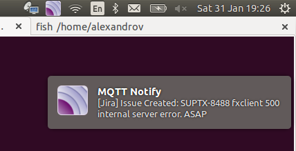
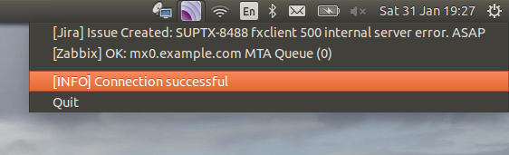

# mqtt-appindicator
This appindicator subscribe to MQTT topics and show messages from them.
It shows messages in the notification area (system tray) on Ubuntu Unity and in Gnome.

# Screenshots





# Feartures
* Auto reconnect if connection to broker was lost

# Incomplete features
* Only one MQTT broker supports now
* Does not support TLS yet

# Known Issues
* App can look hangs if it lost connectivity with broker and user decided to quit from it. mqtt-appindicator will be trying to reconnect to broker and unfortunately it's blocking thread by now.

## Requirements

You'll need at least the following components:

1. Python 2.x (tested with 2.7)
2. An MQTT broker
3. The Paho Python module: pip install paho-mqtt

# Instalithion
1. Clone this repository into a fresh directory
2. Edit config file ```~/.mqtt-appindicator.ini``` (see _Configuration_)
3. Launch ```mqtt-appindicator.py```
4. Add app to startup application by using ```gnome-session-properties``` for example


# Configuration

Settings are storing in ```~/.mqtt-appindicator.ini``` file (it's creates automaticaly after first run).
```ini
[mqtt_broker]
mqtt_server = localhost
mqtt_port = 1883
mqtt_topics = [("my/topic", 0), ("another/topic", 2)]
```
